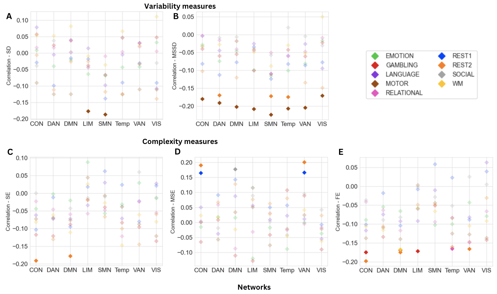
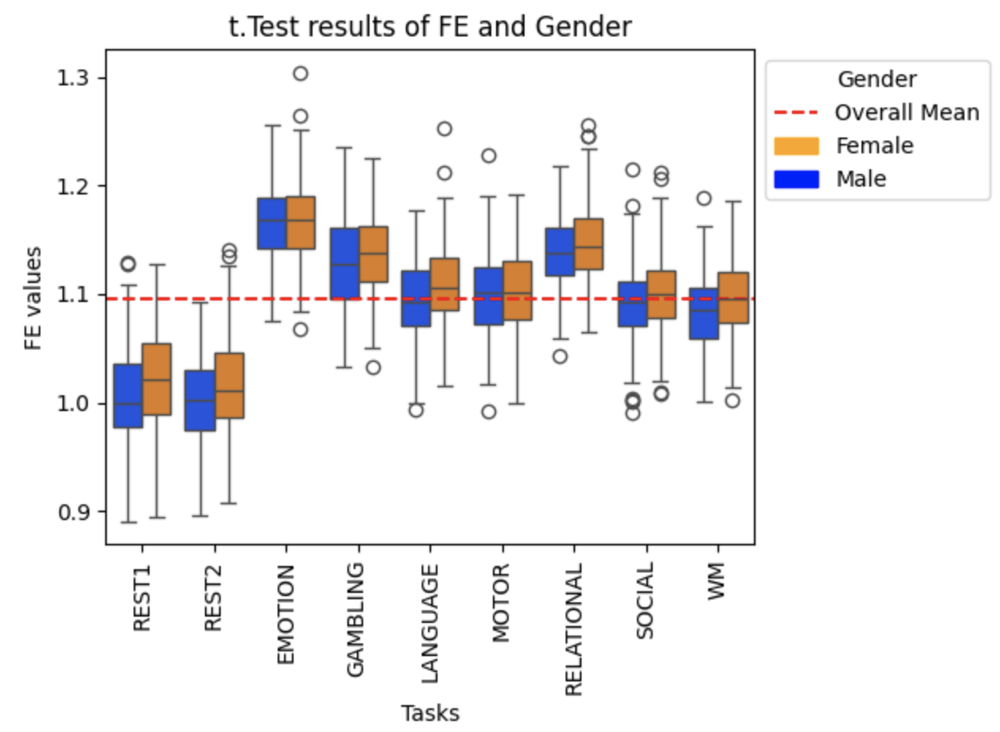

# Results Overview

This folder contains key results from the analysis of neural variability and complexity in fMRI data.

## Main Findings

### 1. Neural Variability and Age
- Neural variability (SD, MSSD) shows a consistent negative correlation with age
- Younger individuals exhibit higher variability, suggesting greater neural flexibility

### 2. Neural Complexity (Entropy Measures)
- Results differ depending on the entropy measure:
  - Sample Entropy (SE) and Fuzzy Entropy (FE) often show positive correlations with age
  - Multiscale Entropy (MSE) shows negative correlations with age
- This indicates that different entropy measures capture distinct aspects of brain dynamics

### 3. Task vs Rest Differences
- Variability is higher during resting-state
- Complexity (entropy) is higher during task execution

### 4. Intelligence and Brain Dynamics
- Weak but task-specific correlations between:
  - Variability and intelligence
  - Complexity and intelligence
- Strongest effects observed in:
  - Motor task
  - Gambling task

### 5. Gender Differences
- No strong effects in variability measures
- Differences found in entropy measures:
  - FE higher in females
  - MSE higher in males

### 6. Network-Specific Effects
- Strong effects in:
  - Default Mode Network (DMN)
  - Control Network (CON)
  - Limbic Network (LIM)

## Example Visualizations

## Full Study

See full thesis here: `../reports/Bachelorarbeit_Final.pdf`
